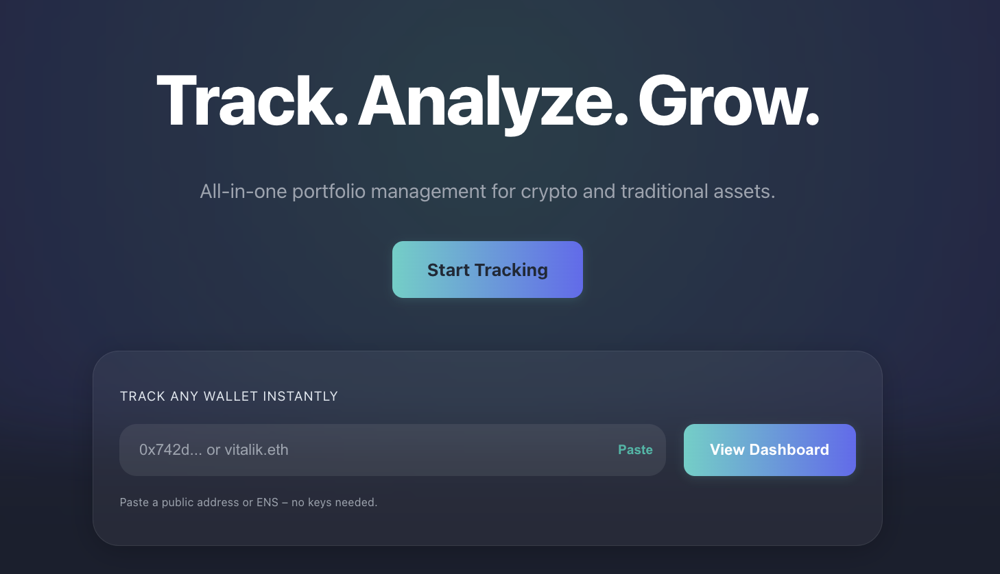

# 🧠 SmartWalletFX

[](https://coveralls.io/github/0x5chn0uf/SmartWalletFX?branch=main)


A comprehensive DeFi portfolio tracker and analytics platform that provides real-time insights into your cryptocurrency positions across multiple protocols. Track your investments, analyze performance, and make informed decisions with institutional-grade tools designed for the modern crypto investor.



---

## 📈 Project Status

SmartWalletFX is currently in active development. The core backend and frontend components are functional, with support for major DeFi protocols such as Aave & Compound. Key features such as real-time portfolio tracking, historical analytics, and risk monitoring are implemented and undergoing continuous improvement.

- **Backend:** Stable, with comprehensive test coverage and production-ready APIs.
- **Frontend:** Usable and responsive, with ongoing enhancements to the dashboard and analytics views.
- **DevOps:** Docker Compose setup available for rapid local deployment; CI/CD pipelines in place.
- **Testing:** Automated backend, frontend, E2E, and performance tests are passing.

**Upcoming:**

- Expanded protocol support
- Advanced analytics and alerting
- Enhanced user management and security features

We welcome feedback and contributions as we move towards a public beta release!

---

## 🌟 What SmartWalletFX Does

SmartWalletFX eliminates the complexity of managing DeFi positions across multiple protocols by providing a unified dashboard that aggregates your entire portfolio in real-time. Whether you're lending on Aave, borrowing on Compound, or participating in liquidity pools on Radiant, SmartWalletFX gives you complete visibility into your financial positions.

### 📊 **Portfolio Management**

- **Multi-Protocol Support**: Automatically tracks positions across Aave, Compound, and Radiant Capital
- **Real-Time Updates**: Live balance tracking and position monitoring
- **Historical Analytics**: Comprehensive timeline showing portfolio performance over time
- **Health Monitoring**: Track collateral ratios, borrowing capacity, and liquidation risks

### 💹 **Performance Analytics**

- **Portfolio Timeline**: Visualize your portfolio's growth and changes over time
- **Risk Assessment**: Monitor health scores and leverage ratios across protocols
- **APY Tracking**: See current yields and borrowing costs for all positions
- **Protocol Breakdown**: Understand how your portfolio is distributed across different platforms

### 🔐 **Security & Privacy**

- **Read-Only Access**: No wallet connection required - just enter your address
- **Private & Secure**: Your data stays private with robust authentication
- **Multi-User Support**: Secure user accounts with role-based permissions
- **Enterprise Grade**: Built with production-ready security standards

### 🎨 **Modern Interface**

- **Intuitive Dashboard**: Clean, responsive design optimized for both desktop and mobile
- **Interactive Charts**: TradingView-style visualizations with multiple timeframes
- **Dark Mode**: Professional dark theme with emerald accents
- **Real-Time Updates**: Live data with intelligent caching for optimal performance

---

## 🚀 Quickstart with Docker Compose

The fastest way to spin up the **entire** SmartWalletFX stack (backend, frontend, PostgreSQL & Redis) is via Docker Compose:

```bash
# 1. Clone & enter the repo
 git clone https://github.com/0x5chn0uf/smartwalletfx.git
 cd smartwalletfx

# 2. Copy environment variables (edit if you need to)
 cp .env.example .env

# 3. Launch the stack – one command 🔥
 ./scripts/start.sh           # builds images & starts containers in the background

# Tail logs (optional)
 STACK_LOGS=1 ./scripts/start.sh
```

When the health-checks pass you'll have:

| Service  | URL                              |
| -------- | -------------------------------- |
| Frontend | http://localhost:3000            |
| Backend  | http://localhost:8000/docs       |
| Postgres | localhost:5432 (devuser/devpass) |
| Redis    | localhost:6379                   |

Stop the stack at any time:

```bash
./scripts/stop.sh        # stop containers, keep DB volume
PURGE=1 ./scripts/stop.sh  # also remove volumes for a clean slate
```

> **Tip:** The Compose file mounts your source code, so changes to the backend or frontend hot-reload automatically.

### One-liner Dev Setup (hot-reload)

Want code-reload on every save? Use the Makefile helper which spawns Postgres & Redis via Docker **once** then starts the backend & frontend in watch-mode:

```bash
make start      # or ./scripts/start_dev.sh
```

Open http://localhost:3000 and start hacking – any change in `backend/` or `frontend/` will instantly reload.

---

## 🛠 Technology Stack

**Backend Infrastructure**

- FastAPI with async/await for high-performance API endpoints
- Direct blockchain integration via web3.py for real-time data
- PostgreSQL with automated backup and restore capabilities
- Redis for intelligent caching and background job processing
- Comprehensive test suite with >95% code coverage
- Serena semantic memory system with selective codebase embedding

**Frontend Experience**

- Modern React application with responsive design
- Professional charting powered by TradingView libraries
- Real-time updates with optimistic UI patterns
- Progressive Web App capabilities for mobile users

**Security & Operations**

- JWT authentication with automated key rotation
- Role-based access control (RBAC) for enterprise users
- Prometheus metrics and monitoring
- CI/CD pipeline with automated security scanning
- Intelligent code search and documentation system

---

## 🛠 Getting Started

### Quick Setup

1. **Clone and Configure**

   ```bash
   git clone https://github.com/0x5chn0uf/smartwalletfx.git
   cd smartwalletfx
   ```

2. **Backend Setup**

   ```bash
   cd backend
   python -m venv .venv
   source .venv/bin/activate
   pip install -e .
   ```

3. **Frontend Setup**

   ```bash
   cd frontend
   npm install
   npm start
   ```

4. **Start Tracking**
   - Navigate to `http://localhost:3000`
   - Create your account
   - Add your wallet address
   - Start monitoring your DeFi positions!

### Environment Configuration

Copy `backend/.env.example` to `backend/.env` and configure:

- **Blockchain RPC URLs**: For real-time data fetching
- **CoinGecko API**: For USD price conversions
- **Database Settings**: PostgreSQL connection details
- **JWT Secrets**: For secure authentication

> **Note**: SmartWalletFX now defaults to **PostgreSQL** for both local development and tests. SQLite is only used as an emergency fallback when Postgres isn't available.

---

## 💡 Use Cases

### **Individual Investors**

- Track DeFi investments across multiple protocols
- Monitor portfolio health and liquidation risks
- Analyze historical performance and trends
- Optimize yield strategies with APY comparisons

### **Professional Traders**

- Manage complex multi-protocol positions
- Real-time risk assessment and position sizing
- Historical analysis for strategy development
- Portfolio reporting and performance attribution

### **Fund Managers**

- Multi-wallet portfolio management
- Client reporting with professional visualizations
- Risk monitoring and compliance reporting
- Automated data exports for external systems

### **DeFi Protocols**

- Integration testing with real user positions
- Market research and user behavior analysis
- Risk assessment tooling for new features
- Customer support with position visibility

---

## 🎯 Vision

SmartWalletFX aims to become the definitive platform for DeFi portfolio management, providing institutional-grade tools that are accessible to everyone. We're building the infrastructure that will power the next generation of decentralized finance, making it easier and safer for users to participate in the DeFi ecosystem.

Our mission is to democratize access to sophisticated financial tools while maintaining the highest standards of security and user experience.

---

## 🛠 Current Status

### ✅ **Production Ready Features**

- Multi-protocol DeFi position tracking (Aave, Compound)
- Real-time portfolio analytics and performance tracking
- Secure user authentication and multi-wallet management
- Professional frontend with interactive charts and dashboards

### 🚧 **Active Development**

- Smart Money Concepts (SMC) technical analysis integration
- Advanced risk metrics and liquidation alerts
- Mobile application development
- Additional protocol integrations (Uniswap, Curve, etc.)
- Enhanced portfolio optimization suggestions

### 🔮 **Planned Features**

- Multi-chain expansion (Polygon, BSC, Avalanche)
- CEX integration for complete portfolio view
- Advanced alerting and notification system
- Portfolio sharing and social features
- API access for third-party integrations

---

## 🔒 Security

Security is our top priority. SmartWalletFX is designed with multiple layers of protection:

- **No Private Keys**: Read-only tracking means your funds stay secure
- **Encrypted Data**: All sensitive information is encrypted at rest and in transit
- **Regular Audits**: Automated security scanning and manual code reviews
- **Secure Infrastructure**: Production-grade hosting with monitoring and backups

## If you discover a security vulnerability, please report it responsibly to our security team.

## 🤝 Contributing

We welcome contributions from the community! Whether you're fixing bugs, adding features, or improving documentation, your help makes SmartWalletFX better for everyone.

- **Bug Reports**: Open an issue with detailed reproduction steps
- **Feature Requests**: Describe your use case and proposed solution
- **Code Contributions**: Fork, create a feature branch, and submit a PR
- **Documentation**: Help improve our guides and API documentation

Please see our [Contributing Guide](CONTRIBUTING.md) for detailed instructions.


## 📜 License

This project is currently private and not available for public use or distribution.

---

## 🔍 Developer Tools

### Serena Semantic Memory System

SmartWalletFX includes **Serena**, an advanced semantic memory and code search system:

- **Semantic Code Search**: Find relevant code using natural language queries
- **Selective Embedding**: Index codebase without exposing full source code
- **Smart Chunking**: Structure-aware code splitting with intelligent overlap
- **Incremental Updates**: SHA-256 hash-based change detection for efficiency
- **Multi-Language Support**: Optimized processing for Python, TypeScript, JavaScript

**Quick Start:**
```bash
# Index your codebase for semantic search
serena embed index

# Search for authentication-related code
serena embed search "JWT token validation middleware"

# Check embedding statistics
serena embed stats
```

See [`serena/docs/CODE_EMBEDDING.md`](serena/docs/CODE_EMBEDDING.md) for comprehensive documentation.

---

## 📞 Support

- **Documentation**: Comprehensive guides and API documentation in the `/docs` folder
- **Issues**: Report bugs or request features via GitHub Issues
- **Community**: Join our community for discussions and updates

**Built with ❤️ for the DeFi community**
