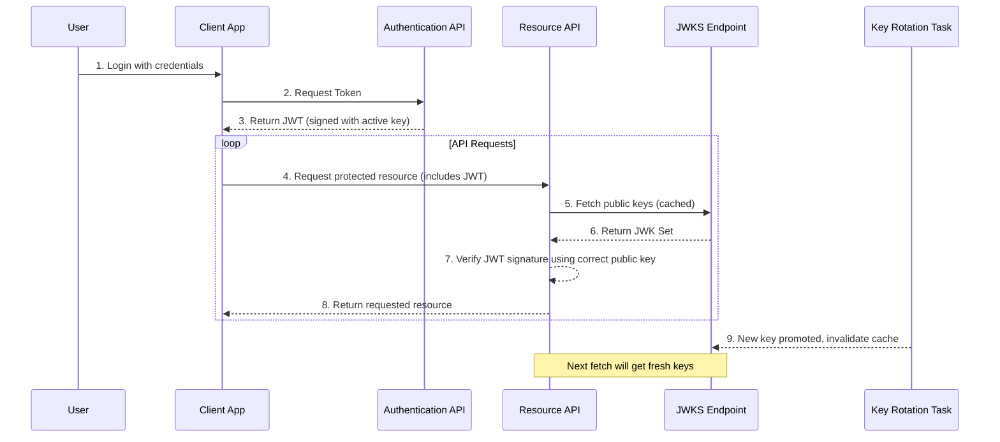

# Authentication Flow & JWT Management

This document provides a high-level overview of the application's authentication system, focusing on JSON Web Tokens (JWTs), automated key rotation, and the JSON Web Key Set (JWKS) endpoint.

## Authentication Flow Overview

The diagram below illustrates the complete, zero-downtime authentication flow from user login to API request verification.

## Key Components

### 1. JSON Web Tokens (JWTs)
- **Standard**: We use standard JWTs (RFC 7519) for authenticating API requests.
- **Claims**: Tokens include standard claims (`sub`, `exp`, `iat`) as well as a critical **`kid` (Key ID)** header, which identifies the specific key used to sign the token.
- **Issuance**: The `/auth/token` endpoint issues JWTs upon successful login.

### 2. JWKS Endpoint (`/.well-known/jwks.json`)
- **Purpose**: This public, unauthenticated endpoint publishes the set of public keys that clients can use to verify JWT signatures. This allows for zero-downtime key rotation without requiring clients to be restarted or reconfigured.
- **Format**: The endpoint returns a standard JSON Web Key Set (RFC 7517).
- **Caching**: The response is aggressively cached in Redis to ensure high performance.

### 3. Automated Key Rotation & Cache Invalidation
- **Server-Side Rotation**: A background Celery task (`promote_and_retire_keys`) runs periodically to automatically promote new signing keys and retire old ones based on a configured grace period.
- **Zero-Downtime Invalidation**: When the rotation task runs, it **immediately invalidates the JWKS cache** in Redis. This is the most critical piece of the zero-downtime strategy, ensuring that the public key set is always fresh after a rotation event.

## JWKS Cache Invalidation & Operational Monitoring

### Integration Details
- **Trigger Point:** Cache invalidation is triggered by the JWT key rotation Celery task, specifically in the `_apply_key_set_update()` function.
- **Mechanism:** After key promotion/retirement, the task calls `invalidate_jwks_cache_sync()`, which deletes the JWKS cache key in Redis.
- **Error Handling:** If cache invalidation fails, the error is logged and an audit event is emitted, but the key rotation process continues. The cache will eventually expire based on its TTL (default: 1 hour).

### Audit Trail
- **Rotation Events**: `JWT_KEY_PROMOTED`, `JWT_KEY_RETIRED`, `JWT_ROTATION_FAILED`.
- **JWKS Events**: `JWKS_REQUESTED` (with `cache_hit` status), `JWKS_CACHE_INVALIDATED`, `JWKS_CACHE_INVALIDATION_FAILED`.

### Metrics & Monitoring
- **Prometheus Metrics:**
  - `jwt_key_rotations_total`, `jwt_key_rotation_errors_total`
  - `jwt_jwks_cache_invalidations_total`, `jwt_jwks_cache_invalidation_errors_total`
- **Alerting:** High error rates in either key rotation or cache invalidation should trigger operational alerts.

For a detailed operational playbook on the rotation task itself, see [JWT Key Rotation – Automated Operational Playbook](auth_key_rotation.md).