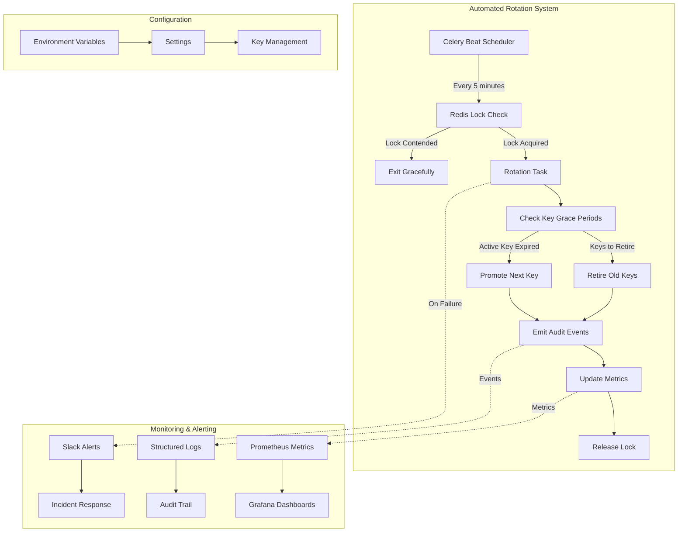
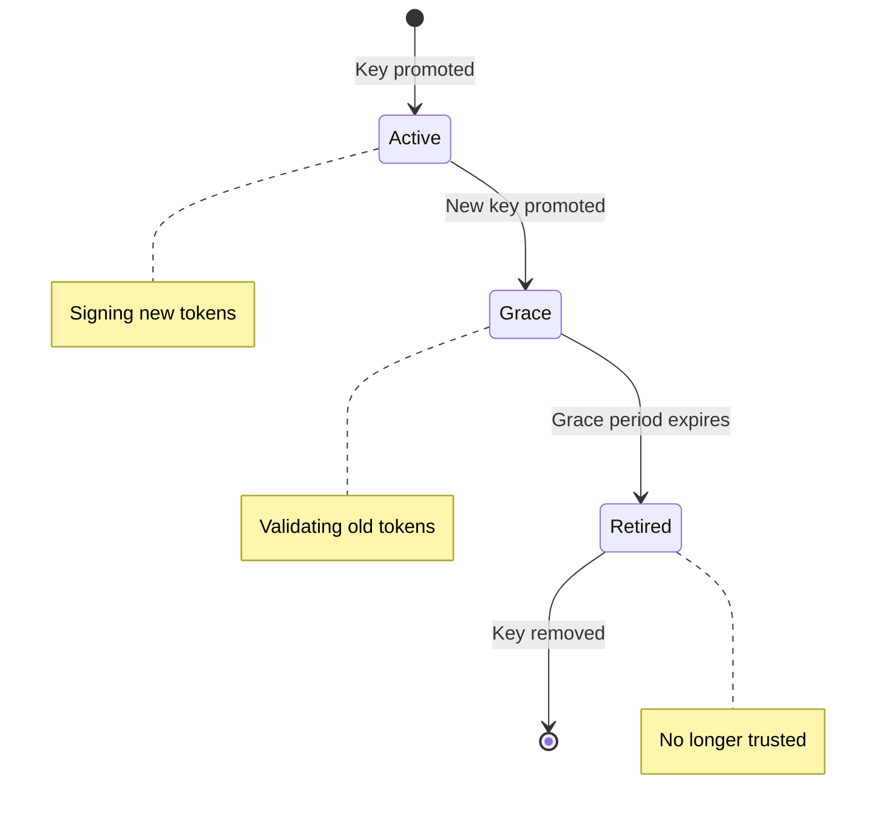

# JWT Key Rotation – Automated Operational Playbook

_Last updated: 2025-06-22_

## Overview
The trading-bot backend now features **fully automated JWT key rotation** that eliminates manual maintenance while ensuring zero-downtime authentication. This system automatically promotes new signing keys and retires old ones based on configurable grace periods, with comprehensive monitoring and alerting.

## System Architecture



## Configuration

### Core JWT Settings
| Setting | Description | Default | Environment Variable |
|---------|-------------|---------|---------------------|
| `JWT_KEYS` | Mapping of `kid` → secret/public key | `{}` | `JWT_KEYS` |
| `ACTIVE_JWT_KID` | Current signing key identifier | `"default"` | `ACTIVE_JWT_KID` |
| `JWT_ROTATION_GRACE_PERIOD_SECONDS` | Grace period for retired keys | `300` | `JWT_ROTATION_GRACE_PERIOD_SECONDS` |

### Automation Settings
| Setting | Description | Default | Environment Variable |
|---------|-------------|---------|---------------------|
| `JWT_ROTATION_SCHEDULE_CRON` | Cron expression for rotation task | `"*/5 * * * *"` | `JWT_ROTATION_SCHEDULE_CRON` |
| `JWT_ROTATION_LOCK_TTL_SEC` | Redis lock TTL (seconds) | `600` | `JWT_ROTATION_LOCK_TTL_SEC` |

### Monitoring Settings
| Setting | Description | Default | Environment Variable |
|---------|-------------|---------|---------------------|
| `PROMETHEUS_ENABLED` | Enable Prometheus metrics | `True` | `PROMETHEUS_ENABLED` |
| `PROMETHEUS_PORT` | Metrics server port | `9090` | `PROMETHEUS_PORT` |
| `PROMETHEUS_HOST` | Metrics server host | `"0.0.0.0"` | `PROMETHEUS_HOST` |

### Alerting Settings
| Setting | Description | Default | Environment Variable |
|---------|-------------|---------|---------------------|
| `SLACK_WEBHOOK_URL` | Slack webhook URL | `None` | `SLACK_WEBHOOK_URL` |
| `SLACK_ALERTING_ENABLED` | Enable Slack alerting | `False` | `SLACK_ALERTING_ENABLED` |
| `SLACK_MAX_ALERTS_PER_HOUR` | Rate limiting | `10` | `SLACK_MAX_ALERTS_PER_HOUR` |
| `JWT_ROTATION_ALERT_ON_ERROR` | Alert on rotation errors | `True` | `JWT_ROTATION_ALERT_ON_ERROR` |
| `JWT_ROTATION_ALERT_ON_RETRY` | Alert on retries | `False` | `JWT_ROTATION_ALERT_ON_RETRY` |

## Automated Rotation Workflow

### 1. Scheduled Execution
- **Frequency**: Every 5 minutes (configurable via `JWT_ROTATION_SCHEDULE_CRON`)
- **Locking**: Redis-based distributed lock ensures single-worker execution
- **Idempotency**: Safe to run multiple times; exits gracefully if lock contended

### 2. Key Lifecycle Management


### 3. Promotion Logic
- **Trigger**: When active key's grace period expires
- **Action**: Promote `NEXT_JWT_KID` to `ACTIVE_JWT_KID`
- **Safety**: Atomic operation with rollback on failure

### 4. Retirement Logic
- **Trigger**: When any key's grace period expires
- **Action**: Remove key from memory and settings
- **Audit**: Emit `JWT_KEY_RETIRED` event with key metadata

## Monitoring & Observability

### Prometheus Metrics
The system exposes the following metrics at `/metrics`:

- `jwt_key_rotations_total`: Counter of successful key promotions
- `jwt_key_retirements_total`: Counter of key retirements
- `jwt_key_rotation_errors_total`: Counter of rotation failures

### Audit Events
Structured JSON logs are emitted for all rotation activities:

```json
{
  "event": "JWT_KEY_PROMOTED",
  "timestamp": "2025-06-22T10:30:00Z",
  "trace_id": "abc123",
  "user_id": null,
  "data": {
    "old_kid": "key_A",
    "new_kid": "key_B",
    "grace_period_seconds": 300
  }
}
```

### Slack Alerting
Configured alerts are sent for:
- **Rotation failures**: When the task encounters errors
- **Retry attempts**: When exponential backoff is triggered (optional)
- **Lock contention**: When multiple workers attempt rotation

## Operational Procedures

### Initial Setup

1. **Configure Key Set**:
   ```bash
   export JWT_KEYS='{"key_A": "secret_A", "key_B": "secret_B"}'
   export ACTIVE_JWT_KID="key_A"
   export NEXT_JWT_KID="key_B"
   ```

2. **Enable Monitoring**:
   ```bash
   export PROMETHEUS_ENABLED=true
   export SLACK_ALERTING_ENABLED=true
   export SLACK_WEBHOOK_URL="https://hooks.slack.com/services/..."
   ```

3. **Start Celery Workers**:
   ```bash
   celery -A app.celery_app worker --loglevel=info
   celery -A app.celery_app beat --loglevel=info
   ```

### Daily Operations

1. **Monitor Metrics**:
   - Check `/metrics` endpoint for rotation activity
   - Verify `jwt_key_rotations_total` is incrementing
   - Monitor `jwt_key_rotation_errors_total` for issues

2. **Review Audit Logs**:
   - Search for `JWT_KEY_PROMOTED` and `JWT_KEY_RETIRED` events
   - Verify rotation timing aligns with grace periods
   - Check for any `JWT_ROTATION_FAILED` events

3. **Slack Alert Monitoring**:
   - Respond to rotation failure alerts within 15 minutes
   - Check for alert rate limiting warnings
   - Verify webhook delivery status

### Incident Response

#### Rotation Failure Alert
1. **Immediate Actions**:
   - Check Celery worker logs for error details
   - Verify Redis connectivity and lock status
   - Review recent audit events for context

2. **Diagnostic Steps**:
   ```bash
   # Check Celery task status
   celery -A app.celery_app inspect active
   
   # Verify Redis lock
   redis-cli GET "jwt_key_rotation_lock"
   
   # Check metrics endpoint
   curl http://localhost:9090/metrics | grep jwt_key
   ```

3. **Recovery Procedures**:
   - **Redis Issues**: Restart Redis service, clear stale locks
   - **Key Configuration**: Verify `JWT_KEYS` and `ACTIVE_JWT_KID` settings
   - **Worker Issues**: Restart Celery workers and beat scheduler

#### Manual Key Rotation
If automated rotation is disabled, manual rotation is still supported:

```python
from app.utils.jwt import rotate_signing_key

# Promote a new key
rotate_signing_key("new_key_id", "new_key_secret")
```

## Troubleshooting Guide

### Common Issues

| Issue | Symptoms | Resolution |
|-------|----------|------------|
| **No rotation activity** | Metrics not incrementing, no audit events | Check Celery beat scheduler, verify cron expression |
| **Lock contention** | Task exits immediately, no rotation | Verify Redis connectivity, check lock TTL settings |
| **Key promotion fails** | `JWT_ROTATION_FAILED` events | Verify `NEXT_JWT_KID` exists in `JWT_KEYS` |
| **Grace period violations** | Users get 401 errors | Increase `JWT_ROTATION_GRACE_PERIOD_SECONDS` |
| **Slack alerts not working** | No alerts received | Verify webhook URL, check rate limiting settings |

### Diagnostic Commands

```bash
# Check Celery beat schedule
celery -A app.celery_app inspect scheduled

# Verify Redis lock status
redis-cli TTL "jwt_key_rotation_lock"

# Test Prometheus metrics
curl -s http://localhost:9090/metrics | grep jwt_key

# Check recent audit logs
grep "JWT_KEY" /var/log/app/audit.log | tail -10
```

### Performance Tuning

- **Lock TTL**: Set `JWT_ROTATION_LOCK_TTL_SEC` to 2× task interval
- **Grace Period**: Use at least 2× access token TTL plus clock skew
- **Cron Frequency**: Balance responsiveness with system load (5 minutes recommended)

## Security Considerations

### Key Management
- **Key Generation**: Use cryptographically secure random generation
- **Key Storage**: Store keys in environment variables or secure vaults
- **Key Rotation**: Rotate keys regularly (recommended: every 30-90 days)
- **Compromise Response**: Set grace period to 0 and rotate immediately

### Audit Trail
- **Event Logging**: All rotation activities are logged with correlation IDs
- **Key Metadata**: Only key IDs (`kid`) are logged, never the actual keys
- **Compliance**: Audit events support compliance requirements (SOC2, ISO27001)

### Access Control
- **Admin Access**: Only authorized personnel can modify key configuration
- **Monitoring Access**: Metrics and logs accessible to operations team
- **Alert Access**: Slack alerts sent to designated security channel

## Integration Points

### Existing Systems
- **Celery**: Uses existing Celery infrastructure for task scheduling
- **Redis**: Leverages Redis for distributed locking and caching
- **Prometheus**: Integrates with existing monitoring stack
- **Slack**: Uses configured webhook for incident alerting

### Future Enhancements
- **JWKS Endpoint**: Planned for Task 113 (JWKS endpoint for zero-downtime rotation)
- **Admin API**: Planned for Task 114 (admin endpoints for key management)
- **SIEM Integration**: Enhanced logging for security information management

## Testing

### Automated Tests
- **Unit Tests**: `backend/tests/unit/jwt_rotation/` - Core logic validation
- **Integration Tests**: `backend/tests/integration/jwt_rotation/` - End-to-end workflows
- **Property Tests**: `backend/tests/property/jwt_rotation/` - Invariant validation

### Manual Testing
```bash
# Test rotation logic
pytest backend/tests/unit/jwt_rotation/

# Test integration scenarios
pytest backend/tests/integration/jwt_rotation/

# Test with time manipulation
pytest backend/tests/property/jwt_rotation/
```

## References

- [Monitoring Documentation](monitoring.md) - Prometheus and Slack setup
- [Security Testing Guide](security_testing.md) - Security validation procedures
- [Logging Standards](logging_standards.md) - Audit event format and standards
- [Celery Documentation](https://docs.celeryproject.org/) - Task scheduling and execution

---

© 2025 Trading-Bot Platform – Security Engineering 