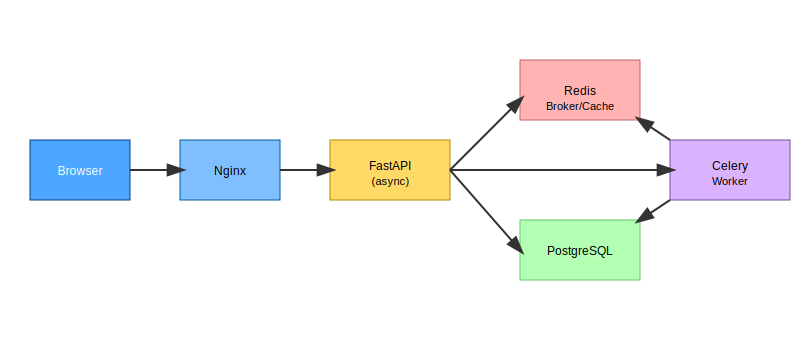

# DeFi Tracker – Knowledge Transfer Deck

> Render with [Marp](https://marp.app/) or GitHub's built-in markdown.

---
# 🚀 DeFi Tracker
### Architecture, APIs & Testing
#### Team Knowledge Transfer – 2025-06-17

---
## Agenda
1. Why DeFi Tracker?
2. System Architecture
3. API Surface
4. Frontend Walkthrough
5. Testing & CI
6. Roadmap & Q&A

---
## 1️⃣ Why DeFi Tracker?
- Unified dashboard for multi-protocol DeFi positions
- Historical performance timeline for wallets
- Foundation for alerts, analytics, and tax reporting

---
## 2️⃣ Architecture (Birds-Eye)

- React SPA → Nginx → FastAPI → PostgreSQL & Redis
- Celery workers for on-chain snapshot aggregation
- Eventual Kafka for real-time streams (Phase 3)

---
## 2️⃣ Layered Hexagonal
| Layer | Example Module |
|-------|----------------|
| Domain | `portfolio.py` |
| Application | `snapshot_aggregation.py` |
| Adapters | `radiant_adapter.py` |
| Infrastructure | `api/endpoints/defi.py` |

---
## 3️⃣ API Highlights
```http
GET /defi/portfolio/{address}
GET /defi/timeline/{address}?interval=daily
POST /defi/admin/trigger-snapshot
```
- OpenAPI & auto-generated TS SDK

---
## 4️⃣ Frontend
- **React + MUI + Recharts**
- `TimelineChart` with responsive design
- React Query handles caching and retries

---
## 5️⃣ Testing Strategy
- Backend: pytest, hypothesis, >90 % cov
- Frontend: RTL, Storybook, >75 % cov
- E2E: Cypress across viewports
- CI coverage gates & badges

---
## 6️⃣ Roadmap
- OAuth2 / JWT auth (Task 4)
- WebSocket live updates (Phase 3)
- Event-driven refactor (Kafka)
- Kubernetes deployment

---
# 🙏 Questions? 