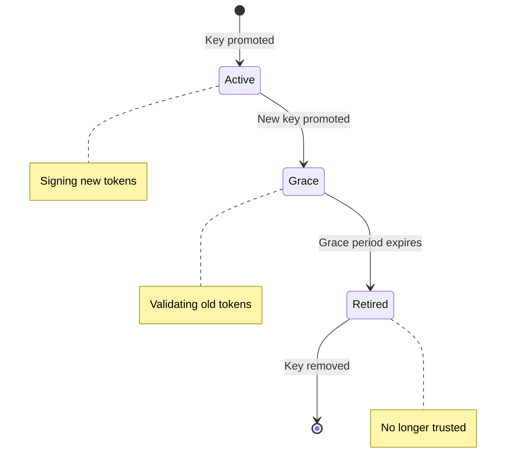
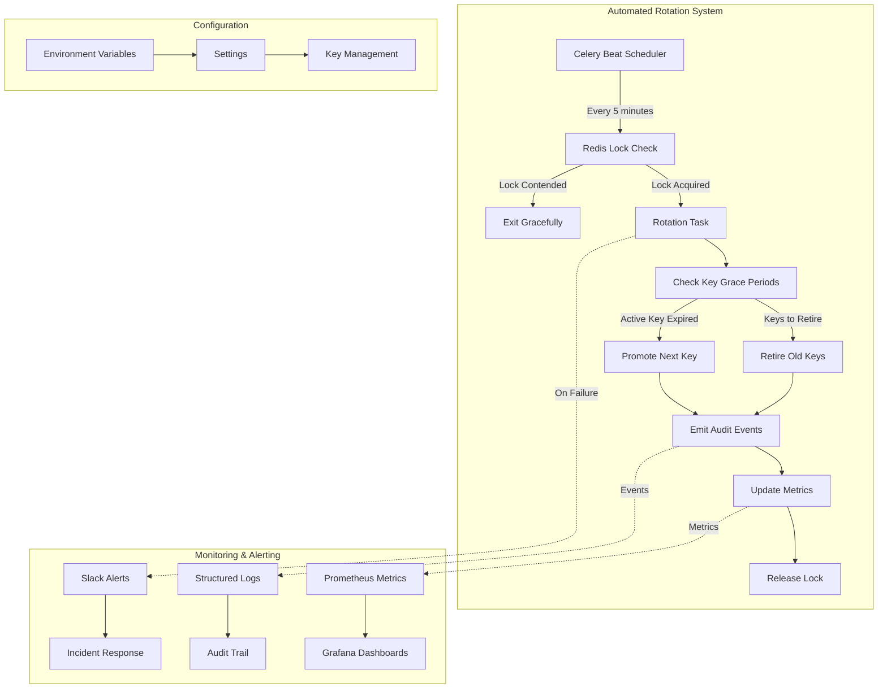
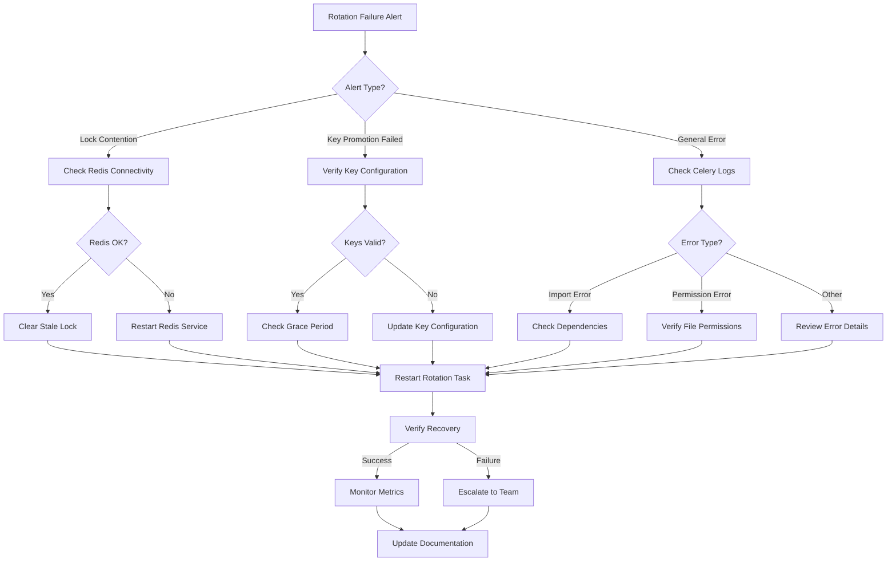
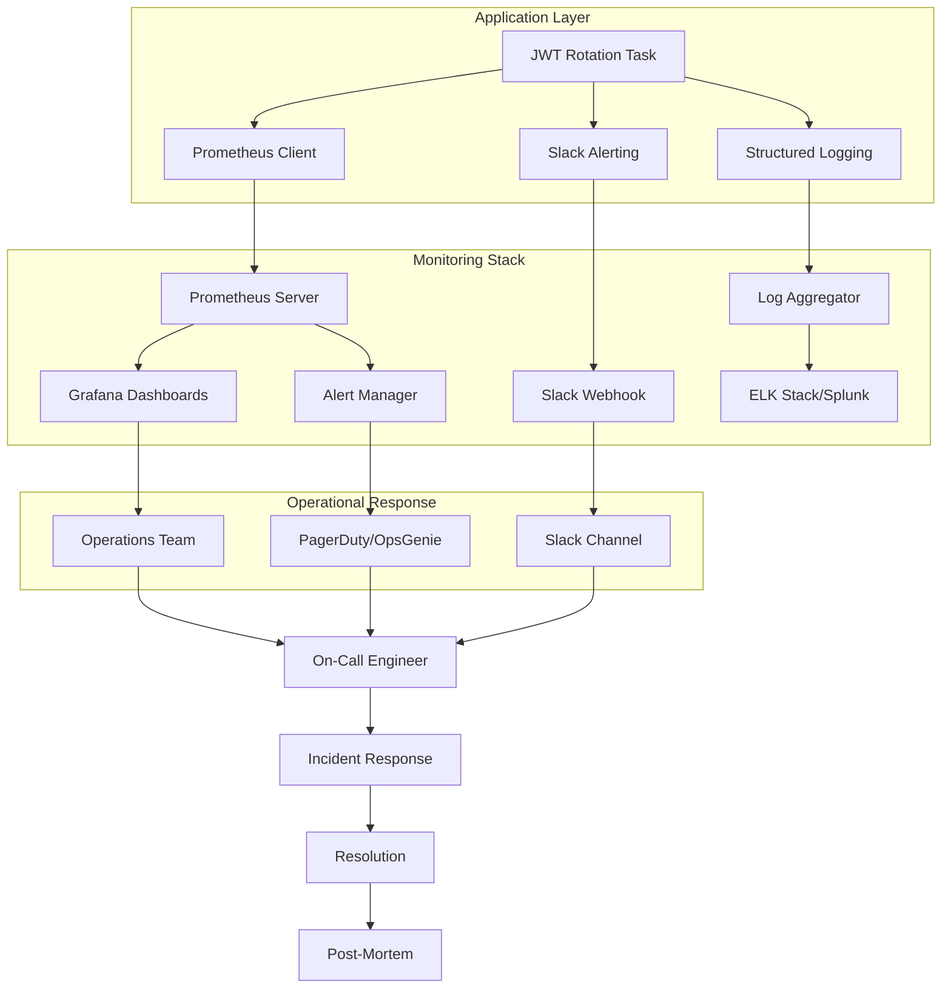
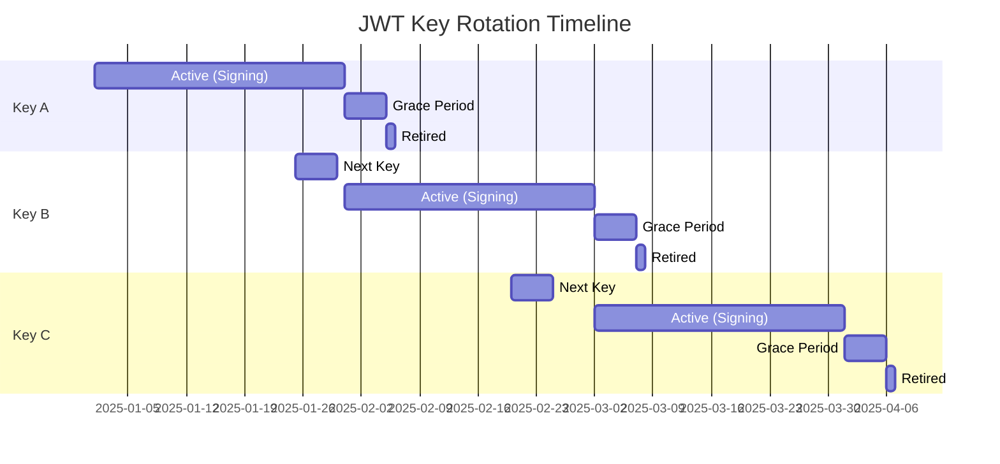
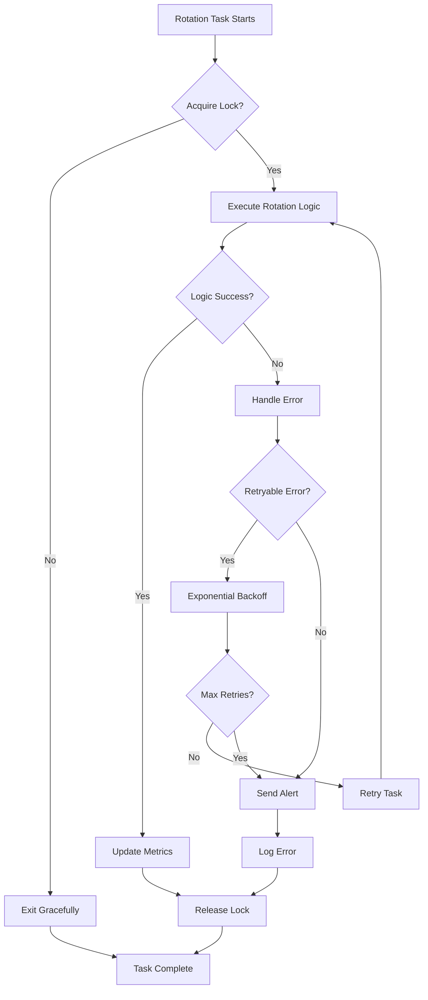

# JWT Key Rotation Flow Diagrams

This file contains Mermaid diagrams for the JWT key rotation system that can be embedded in documentation.

## Key Lifecycle State Diagram

## Automated Rotation Workflow

## Incident Response Flow

## Monitoring Architecture

## Key Rotation Timeline

## Error Handling Flow

