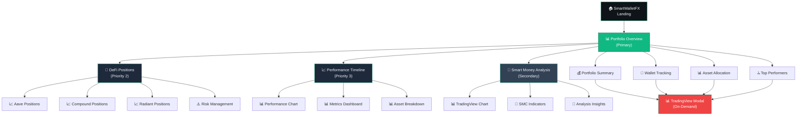

# SmartWalletFX - Interface Design Document

## 🎯 Design Overview

**Target Users:** Portfolio managers and DeFi yield farmers with intermediate to advanced experience (primary), swing traders (secondary)  
**Usage Pattern:** Daily check-ins for portfolio oversight and analysis (not high-frequency trading)  
**Platform:** Desktop-first with rich analytical capabilities (mobile is future consideration)  
**Design Philosophy:** Elegant, minimal, and data-focused interface prioritizing clarity over complexity

### User Experience Principles
- **Simplicity First:** Default views are clean and uncluttered; advanced analytics available on-demand
- **Performance-Oriented:** Fast loading, economical resource usage, real-time updates
- **Accessibility Focus:** TradingView charts readily accessible but not dominating the main interface
- **Daily Workflow Optimized:** Designed for regular oversight rather than continuous monitoring

---

## 🎨 Visual Design System

### Color Palette
**Primary Colors:**
- `#0f1419` - Deep dark background (main)
- `#1e293b` - Card/surface background  
- `#334155` - Borders and dividers
- `#64748b` - Secondary text
- `#f1f5f9` - Primary text (high contrast)

**Accent Colors:**
- `#10b981` - Emerald primary (brand, CTAs)
- `#065f46` - Emerald dark (hover states)
- `#d1fae5` - Emerald light (success backgrounds)

**Status Colors:**
- `#22c55e` - Profit/Positive (bright green)
- `#ef4444` - Loss/Negative (red)
- `#f59e0b` - Warning/Neutral (amber)
- `#3b82f6` - Information (blue)

### Typography
- **Headers:** Inter Bold (24px, 20px, 18px)
- **Body Text:** Inter Regular (14px, 16px)
- **Data/Numbers:** JetBrains Mono (monospace for consistency)
- **Small Text:** Inter Regular (12px)

### Component Standards
- **Border Radius:** 8px (cards), 4px (buttons, inputs)
- **Shadows:** Subtle `0 1px 3px rgba(0, 0, 0, 0.12)`
- **Spacing:** 8px base unit (8, 16, 24, 32, 48px)
- **Animation:** 200ms ease transitions

---

## 📐 Layout Architecture

### Primary Navigation (Left Sidebar - 280px width)
```
┌─────────────────────────────────┐
│ 🧠 SmartWalletFX               │
├─────────────────────────────────┤
│ 📊 Portfolio Overview          │ ← Active state
│ 🏦 DeFi Positions             │
│ 📈 Performance Timeline        │
│ 🎯 Smart Money Analysis       │
│ 🔔 Alerts & Notifications     │
├─────────────────────────────────┤
│ ⚙️  Settings                   │
│ 👤 Profile                     │
└─────────────────────────────────┘
```

### Top Bar (Full width - 64px height)
```
┌─────────────────────────────────────────────────────────────────────┐
│ Portfolio Value: $127,543.21 (+2.34%) | Last Update: 2min ago | 🔔 │
└─────────────────────────────────────────────────────────────────────┘
```

### Main Content Area (Flexible width)
Dynamic content area adapting to sidebar state (collapsed/expanded)

---

## 🖼️ Main Dashboard Wireframe

### Portfolio Overview Page (Priority #1)

```
┌─ PORTFOLIO OVERVIEW ─────────────────────────────────────────────────┐
│                                                                      │
│ ┌─ Portfolio Summary Card ────────────────────┐ ┌─ Quick Actions ─┐  │
│ │                                             │ │                 │  │
│ │ Total Value: $127,543.21                   │ │ + Add Wallet    │  │
│ │ 24h Change: +$2,847.32 (+2.34%) ↗️         │ │ 🔄 Refresh      │  │
│ │ Active Wallets: 3                          │ │ 📊 Export       │  │
│ │                                             │ │ ⚙️ Settings     │  │
│ │ [Mini Performance Chart - 7 days]          │ │                 │  │
│ └─────────────────────────────────────────────┘ └─────────────────┘  │
│                                                                      │
│ ┌─ Wallets & Balances ──────────────────────────────────────────────┐ │
│ │                                                                    │ │
│ │ 🔹 Main Wallet (0x1234...5678)                    $45,231.45      │ │
│ │    ETH: 12.34 ($22,345.67)  USDC: 15,000 ($15,000)               │ │
│ │    Health Score: 🟢 Excellent                                      │ │
│ │                                                              [⚙️] │ │
│ │                                                                    │ │
│ │ 🔹 DeFi Wallet (0xabcd...efgh)                    $67,842.31      │ │
│ │    ETH: 8.12 ($14,567.89)  AAVE: 234 ($18,234.12)               │ │
│ │    Health Score: 🟡 Moderate                                      │ │
│ │                                                              [⚙️] │ │
│ │                                                                    │ │
│ │ 🔹 Yield Wallet (0x9876...4321)                   $14,469.45      │ │
│ │    USDT: 8,000 ($8,000)  CRV: 145 ($2,345.67)                   │ │
│ │    Health Score: 🟢 Excellent                                      │ │
│ │                                                              [⚙️] │ │
│ └────────────────────────────────────────────────────────────────────┘ │
│                                                                      │
│ ┌─ Asset Allocation ────────────────┐ ┌─ Top Performers (24h) ──────┐  │
│ │                                   │ │                             │  │
│ │ [Donut Chart]                     │ │ AAVE: +12.45% 📈            │  │
│ │                                   │ │ ETH: +3.21% 📈              │  │
│ │ ETH: 45.2%                       │ │ CRV: +1.89% 📈              │  │
│ │ USDC: 28.1%                      │ │ USDT: 0.00% ➡️              │  │
│ │ AAVE: 15.3%                      │ │ BTC: -2.11% 📉              │  │
│ │ Others: 11.4%                    │ │                             │  │
│ │                                   │ │ [View All Assets] →         │  │
│ └───────────────────────────────────┘ └─────────────────────────────┘  │
└──────────────────────────────────────────────────────────────────────┘
```

### DeFi Positions Page (Priority #2)

```
┌─ DEFI POSITIONS ─────────────────────────────────────────────────────┐
│                                                                      │
│ ┌─ Position Summary ──────────────────────────────────────────────┐   │
│ │ Total Supplied: $89,234.56    Total Borrowed: $32,145.78       │   │
│ │ Net Position: $57,088.78      Average Health Factor: 2.45      │   │
│ │ Active Protocols: 3           Yield Generated (30d): $1,247.32  │   │
│ └──────────────────────────────────────────────────────────────────┘   │
│                                                                      │
│ ┌─ Aave Positions ─────────────────────────────────────────────────┐   │
│ │                                                                  │   │
│ │ 📊 Supplied Assets                    📊 Borrowed Assets         │   │
│ │ ┌─────────────────────────────────┐   ┌──────────────────────────┐ │   │
│ │ │ ETH: 8.45 ($15,234.67)         │   │ USDC: 8,500 ($8,500.00)  │ │   │
│ │ │ APY: 3.24% 🟢                  │   │ APY: 5.67% 🔴            │ │   │
│ │ │                                 │   │                          │ │   │
│ │ │ USDC: 12,000 ($12,000.00)      │   │ WETH: 2.1 ($3,789.23)   │ │   │
│ │ │ APY: 4.12% 🟢                  │   │ APY: 4.89% 🔴            │ │   │
│ │ └─────────────────────────────────┘   └──────────────────────────┘ │   │
│ │                                                                  │   │
│ │ Health Factor: 2.67 🟢 | Liquidation Risk: Low                  │   │
│ │ [Manage Position] [View Details] [Charts] 📊                    │   │
│ └──────────────────────────────────────────────────────────────────┘   │
│                                                                      │
│ ┌─ Compound Positions ─────────────────────────────────────────────┐   │
│ │ Similar layout to Aave...                                        │   │
│ └──────────────────────────────────────────────────────────────────┘   │
│                                                                      │
│ ┌─ Risk Management ───────────────────────────────────────────╗     │
│ │ ⚠️  Alerts Active:                                         ║     │
│ │ • Health factor below 1.5: SMS + Email                    ║     │
│ │ • Liquidation risk high: Immediate notification           ║     │
│ │ • APY changes >2%: Daily digest                           ║     │
│ │                                           [Manage Alerts] ║     │
│ ╚═══════════════════════════════════════════════════════════╝     │
└──────────────────────────────────────────────────────────────────────┘
```

### Performance Timeline Page (Priority #3)

```
┌─ PERFORMANCE TIMELINE ───────────────────────────────────────────────┐
│                                                                      │
│ ┌─ Time Period Selector ──────────────────────────────────────────┐   │
│ │ [7D] [30D] [90D] [1Y] [All] [Custom Range]                      │   │
│ │                                              Current: 30 Days   │   │
│ └──────────────────────────────────────────────────────────────────┘   │
│                                                                      │
│ ┌─ Portfolio Performance Chart ────────────────────────────────────┐   │
│ │                                                                  │   │
│ │ $140k ┌─────────────────────────────┐                           │   │
│ │       │     📈 Portfolio Value      │                           │   │
│ │ $120k │                            │ Current: $127,543.21       │   │
│ │       │          /\                │ 30d Change: +$8,234.56     │   │
│ │ $100k │       /\/   \              │ 30d %: +6.9% 🟢            │   │
│ │       │    /\/       \             │                           │   │
│ │ $80k  │ /\/           \/           │ [Show Breakdown]          │   │
│ │       └─────────────────────────────┘                           │   │
│ │          Jan    Feb    Mar    Apr                               │   │
│ └──────────────────────────────────────────────────────────────────┘   │
│                                                                      │
│ ┌─ Performance Metrics ────────────────────────────────────────────┐   │
│ │                                                                  │   │
│ │ 📊 Total Return: +18.4%        📊 Annualized: +24.7%            │   │
│ │ 📊 Best Day: +$4,567 (Apr 15)  📊 Worst Day: -$2,134 (Mar 8)   │   │
│ │ 📊 Volatility: 12.3%           📊 Sharpe Ratio: 1.87            │   │
│ │ 📊 Max Drawdown: -8.2%         📊 Recovery Time: 12 days        │   │
│ │                                                                  │   │
│ └──────────────────────────────────────────────────────────────────┘   │
│                                                                      │
│ ┌─ Asset Performance Breakdown ────────────────────────────────────┐   │
│ │                                                                  │   │
│ │ Asset       | 30d Return | Contribution | Allocation | Action   │   │
│ │ ────────────┼────────────┼─────────────┼────────────┼─────────  │   │
│ │ ETH         | +12.4% 🟢  | +$3,456     | 45.2%      | [Chart] │   │
│ │ AAVE        | +23.1% 🟢  | +$2,789     | 15.3%      | [Chart] │   │
│ │ USDC        | +0.1% ➡️   | +$28        | 28.1%      | [Chart] │   │
│ │ CRV         | +8.9% 🟢   | +$445       | 6.8%       | [Chart] │   │
│ │ Others      | +5.2% 🟢   | +$287       | 4.6%       | [View]  │   │
│ │                                                                  │   │
│ └──────────────────────────────────────────────────────────────────┘   │
└──────────────────────────────────────────────────────────────────────┘
```

### Smart Money Analysis Page (Secondary Feature)

```
┌─ SMART MONEY ANALYSIS ───────────────────────────────────────────────┐
│                                                                      │
│ ┌─ Asset Selector ─────────────────────────────────────────────────┐  │
│ │ [BTC] [ETH] [Custom Symbol]         Timeframe: [1H] [4H] [1D]    │  │
│ │                                                   Current: ETH/USD │  │
│ └──────────────────────────────────────────────────────────────────┘  │
│                                                                      │
│ ┌─ TradingView Chart Integration ──────────────────────────────────┐   │
│ │                                                                  │   │
│ │                 [TradingView Chart Area]                         │   │
│ │                                                                  │   │
│ │ • Fair Value Gaps (FVG) marked                                  │   │
│ │ • Order Blocks (OB) highlighted                                 │   │
│ │ • Breaker Blocks (BB) indicated                                 │   │
│ │ • Multi-timeframe levels visible                                │   │
│ │                                                                  │   │
│ │                                              [Fullscreen] 🔍    │   │
│ └──────────────────────────────────────────────────────────────────┘   │
│                                                                      │
│ ┌─ SMC Indicators Panel ──────────────┐ ┌─ Market Structure ────────┐  │
│ │                                     │ │                           │  │
│ │ 🎯 Active Fair Value Gaps:          │ │ Trend: Bullish 📈         │  │
│ │ • ETH: $1,847 - $1,923             │ │ Last Break: $1,945        │  │
│ │ • BTC: $26,234 - $26,891           │ │                           │  │
│ │                                     │ │ Structure Shift: 4H       │  │
│ │ 📦 Order Blocks (Last 7d):         │ │ Momentum: Strong          │  │
│ │ • Bullish OB: $1,789               │ │                           │  │
│ │ • Bearish OB: $1,967               │ │ Key Levels:               │  │
│ │                                     │ │ • Support: $1,789         │  │
│ │ 🔄 Breaker Blocks:                 │ │ • Resistance: $1,967      │  │
│ │ • Recently broken: $1,834          │ │                           │  │
│ │ • Potential: $1,923                │ │ [Detailed Analysis] →     │  │
│ │                                     │ │                           │  │
│ └─────────────────────────────────────┘ └───────────────────────────┘  │
│                                                                      │
│ ┌─ Analysis Insights ──────────────────────────────────────────────┐   │
│ │                                                                  │   │
│ │ 💡 Current Setup: ETH showing strong bullish structure with      │   │
│ │    multiple fair value gaps acting as support. Order block      │   │
│ │    at $1,789 remains valid for potential entries.               │   │
│ │                                                                  │   │
│ │ 🎯 Key Levels to Watch:                                          │   │
│ │ • Entry Zone: $1,789 - $1,834 (Order Block + FVG)             │   │
│ │ • Target: $1,923 - $1,967 (Next FVG + Resistance)             │   │
│ │ • Invalidation: Below $1,756                                   │   │
│ │                                                                  │   │
│ │                                          [Generate Report] 📋   │   │
│ └──────────────────────────────────────────────────────────────────┘   │
└──────────────────────────────────────────────────────────────────────┘
```

---

## 🔧 Key UI Components

### 1. Portfolio Summary Card
- **Purpose:** High-level portfolio status
- **Data:** Total value, 24h change, wallet count, mini chart
- **Interactions:** Click to expand details, hover for tooltips
- **State:** Updates every 2 minutes, loading indicators

### 2. Wallet Row Component
- **Structure:** Wallet name/address, total value, top assets, health score
- **Actions:** Settings gear, expand/collapse, quick actions
- **Visual:** Health score color coding (🟢🟡🔴)

### 3. Asset Performance Table
- **Sortable:** By return, value, allocation percentage
- **Expandable:** Click asset name for detailed view + chart access
- **Actions:** Quick chart button for TradingView integration

### 4. DeFi Position Cards
- **Layout:** Split view (supplied vs borrowed)
- **Health Indicators:** Visual health factor with risk levels
- **Quick Actions:** Manage, details, charts buttons

### 5. Chart Integration Points
- **Trigger:** Click asset name or chart icon
- **Implementation:** Modal or slide-out panel with TradingView
- **Context:** Pre-loaded with relevant token pair

### 6. Smart Money Analysis Component
- **Purpose:** Technical analysis with SMC indicators for BTC/ETH
- **Features:** Fair Value Gaps, Order Blocks, Breaker Blocks visualization
- **Integration:** Embedded TradingView with custom indicators
- **User Flow:** Secondary feature accessible from main nav, not dominating interface

---

## 🚀 Interaction Patterns

### Navigation Flow
1. **Primary Path:** Portfolio Overview → Asset Details → TradingView Chart
2. **Secondary Path:** DeFi Positions → Position Management → Risk Alerts
3. **Tertiary Path:** Performance Timeline → Historical Analysis → Export

### Data Loading States
- **Skeleton Screens:** For portfolio cards during initial load
- **Progressive Loading:** Load wallet data sequentially
- **Error States:** Clear messaging with retry options
- **Offline Mode:** Cached data with "last updated" timestamps

### Responsive Behaviors
- **Sidebar:** Collapsible to icon-only mode
- **Cards:** Stack vertically on narrow screens (future mobile)
- **Tables:** Horizontal scroll with fixed columns
- **Charts:** Maintain aspect ratio, zoom controls

---

## 📱 Future Mobile Considerations

While desktop-first, the architecture supports future mobile development:

- **Tabbed Navigation:** Bottom tabs replacing sidebar
- **Swipe Gestures:** Card carousels, chart interactions
- **Touch Targets:** 44px minimum, adequate spacing
- **Progressive Disclosure:** Collapsed cards with expand actions

---

## ⚡ Performance Optimization

### Data Management
- **Lazy Loading:** Load charts only when needed
- **Data Pagination:** For transaction history
- **Caching Strategy:** 2-minute cache for price data
- **WebSocket Updates:** Real-time price/health factor updates

### Resource Efficiency
- **Component Virtualization:** For large asset lists
- **Image Optimization:** Token icons, lazy loading
- **Bundle Splitting:** Route-based code splitting
- **Memory Management:** Cleanup chart instances

---

## 🎯 Usability Challenges & Solutions

### Challenge: Information Density
**Solution:** Progressive disclosure with expandable sections and contextual details on demand

### Challenge: Real-time Data Sync
**Solution:** Clear "last updated" timestamps, loading states, and manual refresh options

### Challenge: Complex DeFi Health Scoring
**Solution:** Color-coded visual indicators with explanatory tooltips and risk level descriptions

### Challenge: Multi-wallet Management
**Solution:** Consistent wallet identification (colors, icons) and grouped/ungrouped views

---

## 🔮 Innovative Opportunities

### 1. Smart Notifications
- **Context-aware alerts** based on user behavior patterns
- **Predictive warnings** for potential liquidation risks
- **Yield optimization suggestions** based on current positions

### 2. Visual Health Monitoring
- **Real-time health score visualization** with trend indicators
- **Risk heat maps** for portfolio allocation
- **Historical health factor charts** for risk assessment

### 3. Advanced Analytics
- **Correlation analysis** between assets
- **Yield farming opportunity scoring**
- **Market condition indicators** integrated with portfolio data

### 4. Workflow Automation
- **Position rebalancing suggestions**
- **Automated report generation**
- **Smart alert escalation** based on urgency

---

## 📋 Implementation Priority

### Phase 1: Core Dashboard (Weeks 1-2)
- Portfolio overview layout and navigation
- Basic wallet tracking components
- Asset allocation visualization

### Phase 2: DeFi Integration (Weeks 3-4)
- DeFi position tracking
- Health factor monitoring
- Basic alert system

### Phase 3: Performance Analytics (Weeks 5-6)
- Performance timeline implementation
- Historical data visualization
- Export functionality

### Phase 4: Polish & Optimization (Week 7-8)
- TradingView chart integration
- Performance optimization
- Advanced interactions and micro-animations

---

---

## 🤝 Collaborative Design Insights

### Key Design Decisions Made
1. **User-Centered Approach:** Tailored specifically for portfolio managers and DeFi yield farmers who need daily oversight tools
2. **Information Hierarchy:** Portfolio overview takes priority, with DeFi positions and performance analytics as core features
3. **Chart Strategy:** TradingView integration available on-demand rather than dominating the interface
4. **Simplicity Focus:** Clean default views with detailed analytics accessible when needed
5. **Performance Priority:** Optimized for fast loading and economical resource usage

### User Experience Optimizations
- **Daily Workflow:** Interface designed for regular check-ins rather than continuous monitoring
- **Progressive Disclosure:** Complex information revealed contextually to avoid overwhelming users
- **Accessibility:** Important features easily discoverable but not visually distracting
- **Desktop-First:** Rich analytical capabilities optimized for desktop usage patterns

### Information Architecture Flow
The following diagram illustrates the user navigation flow and feature hierarchy:



### Technical Implementation Considerations
- **Component Library:** Flexible architecture supporting elegant, minimal design without heavy frameworks
- **Real-time Updates:** Efficient data management with appropriate caching and refresh strategies
- **Scalability:** Architecture supports future mobile development while maintaining desktop focus

---

## 🚀 Next Steps for Implementation

### Immediate Actions
1. **Frontend Setup:** Initialize React application with TypeScript and component architecture
2. **Design System:** Implement the color palette, typography, and component standards defined above
3. **Layout Framework:** Build the sidebar navigation and main content area structure
4. **Core Components:** Start with Portfolio Summary Card and Wallet Row components

### Development Sequence
1. **Week 1:** Set up project structure, design system, and basic layout
2. **Week 2:** Implement Portfolio Overview page with mock data
3. **Week 3:** Add DeFi Positions tracking and health factor visualization
4. **Week 4:** Integrate Performance Timeline with charts and metrics

### Design Validation
- **User Testing:** Validate workflows with target user personas (portfolio managers, DeFi farmers)
- **Performance Testing:** Ensure fast loading and smooth interactions
- **Accessibility Review:** Confirm usability and information hierarchy effectiveness

---

*This design document serves as a comprehensive guide for implementing the SmartWalletFX user interface, prioritizing the needs of portfolio managers and DeFi yield farmers while maintaining simplicity and analytical depth.* 