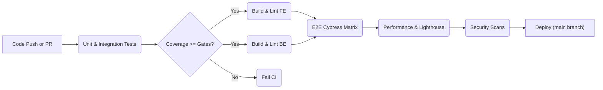

# Testing & Validation Strategy

> **Status:** Draft – v0.1 (2025-06-15)

This document defines the overarching principles, layers, and processes that govern automated and manual testing for the SmartWalletFX DeFi Tracker. It is authored as part of **Subtask 2.7 – Develop Testing & Validation Strategy**.

## Guiding Principles

1. **Defense in Depth** – Multiple layers of tests (unit ➜ integration ➜ E2E ➜ performance ➜ security) catch regressions early.
2. **Fast Feedback** – Local runs < 10 s (unit), CI feedback < 5 m. Tests are thoughtfully scoped to avoid unnecessary waits.
3. **Risk-Based Coverage** – Critical financial calculations, protocol adapters, and balance visualisations receive higher coverage than auxiliary UI.
4. **Single Source of Truth** – Schemas and contracts are shared across backend & frontend (OpenAPI, generated types) to prevent drift.
5. **Shift-Left Security** – Static analysis (Bandit, Safety, detect-secrets) runs on every commit.

## Test Layers & Tooling

| Layer                  | Purpose                                             | Tools                                                  | Target Coverage / KPI                         |
| ---------------------- | --------------------------------------------------- | ------------------------------------------------------ | --------------------------------------------- |
| Unit (Backend)         | Exercise isolated functions, services, adapters     | `pytest`, `pytest-asyncio`, `pytest-cov`, `hypothesis` | ≥ 90 % statements                             |
| Integration (Backend)  | Validate DB, Celery, 3rd-party protocol clients     | `pytest` w/ Docker fixtures, `alembic` test migrations | Critical paths fully exercised                |
| Property-Based         | Explore edge-cases & invariants for financial maths | `hypothesis` strategies                                | At least 1 property test per core math module |
| Unit (Frontend)        | Pure component logic & hooks                        | `Jest`, `RTL`                                          | ≥ 75 % statements                             |
| Component / Snapshot   | Visual regressions & DOM structure                  | `Storybook`, `@storybook/testing-library`              | Baseline snapshots for all charts/cards       |
| Integration (Frontend) | User flows decoupled from network                   | `RTL` + **msw**                                        | All pages have API-mocked tests               |
| E2E                    | Full stack verification incl. auth flows            | `Cypress`                                              | Desktop (1366×768) & Mobile (375×667) green   |
| Performance            | Time-to-first-byte, Lighthouse scores               | `pytest-bench`, `lhci`                                 | Lighthouse PWA score ≥ 90                     |
| Security               | Static & dependency scanning                        | `Bandit`, `Safety`                                     | 0 critical issues                             |

## CI Pipeline Overview

## Contribution Workflow

1. **Red-Green-Refactor** – Write failing test, implement code, refactor.
2. Add or update tests mirroring the layer of change (service → unit/integration; UI → RTL/msw; cross-layer → Cypress).
3. Ensure `npm test` & `pytest` pass locally **before** pushing.
4. Keep mocks in `src/mocks/` (frontend) and `tests/mocks/` (backend).
5. New public APIs require contract tests and OpenAPI schema updates.

## Roadmap & Follow-Ups

- Raise frontend coverage to 75 % (currently 58 %) via additional hooks & chart tests.
- Add Lighthouse-CI GitHub Action and budget file.
- Implement Cypress visual diff plugin for screenshot regression.
- Automate Hypothesis select strategies generation for numeric invariants.

---

